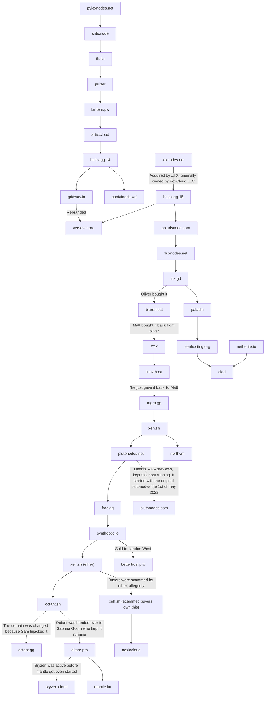
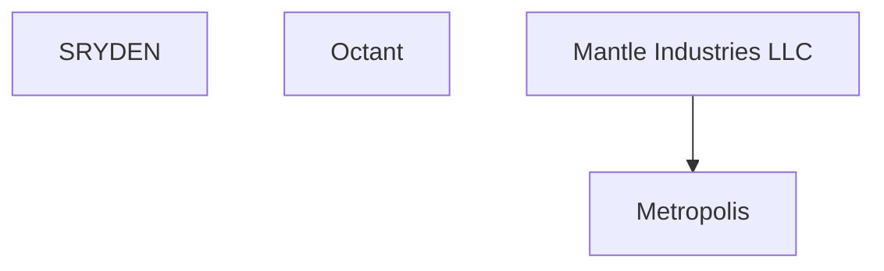

## Hosts
:::info

Some of the text in this graph is a link

:::

```mermaid
graph TD;
  PY[pylexnodes.net] --> CRIT;
  CRIT[criticnode] --> THAL[thala];
  THAL --> PU;
  PU[pulsar] --> LA;
  LA[lantern.pw] --> A[artix.cloud];
  A --> H14[halex.gg 14];

  H14 --> CO[containeris.wtf];
  H14 --> GR[gridway.io];

  FO[foxnodes.net] -->|Acquired by ZTX, originally owned by FoxCloud LLC| H15[halex.gg 15];
  H15 --> PO[polarisnode.com];

  GR --> |Rebranded| VE[versevm.pro]
  H15 --> VE;

  PO --> FLUX[fluxnodes.net]
  FLUX--> Z[ztx.gd];

  Z --> PA[paladin];
  PA --> ZEN[zenhosting.org]

  Z -->|Oliver bought it| BL[blare.host];
  BL -->|Matt bought it back from oliver| Z2[ZTX];
  Z2 --> LU;
  LU[lunx.host] -->|'he just gave it back' to Matt| TE[tegra.gg];
  TE --> X1[xeh.sh];
  X1 --> NO[northvm];
  X1 --> PL[plutonodes.net];
  PL -->|Dennis, AKA previews, kept this host running. It started with the original plutonodes the 1st of may 2022| PLC[plutonodes.com];
  PL --> FR[frac.gg];
  FR --> SY[synthoptic.io];
  SY -->|Sold to Landon West| BE[betterhost.pro];
  SY --> XEE["xeh.sh (ether)"];
  XEE -->|Buyers were scammed by ether, allegedly| XEB["xeh.sh (scammed buyers own this)"];

  XEB --> N["nexiocloud"];
  XEE --> OSH["octant.sh"];
  OSH -->|Octant was handed over to Sabrina Goom who kept it running| AL["altare.pro"];
  OSH -->|The domain was changed because Sam hijacked it| OGG["octant.gg"];
  AL --> MA["mantle.lat"];
  AL -->|Sryzen was active before mantle got even started| SRZ["sryzen.cloud"]

  NE[netherite.io] --> D[died];
  ZEN --> D;

  click PY href "/Hosts/pylexnodes.net";

  click PO href "/Hosts/polarisnode.com";
  click XEE href "/Hosts/xeh.sh";
  click XEB href "/Hosts/nexiocloud.sh";

  click H14 href "/Hosts/halex.gg";
  click H15 href "/Hosts/halex.gg#halex-14";

  click GR href "/Hosts/gridway.io";
  click VE href "/Hosts/gridway.io";

  click TE href "/Hosts/tegra.gg";
  click O href "/Hosts/octant.gg";
  click N href "/Hosts/nexiocloud";
  click NO href "/Hosts/northvm.net";
  click AL href "/Hosts/altare.pro";
  click MA href "/Hosts/mantle.lat";
  click SRZ href "/Hosts/sryzen.cloud";
```

## Legal entities

```mermaid
graph TD;
  SRYD["SRYDEN"];
  OCT["Octant"];
  MANT["Mantle Industries LLC"] --> METR["Metropolis"];

  click SRYD href "/companies/SRYDEN";
  click OCT href "/companies/Octant";
  click MANT href "/companies/Mantle";
  click METR href "/companies/Metropolis";
```