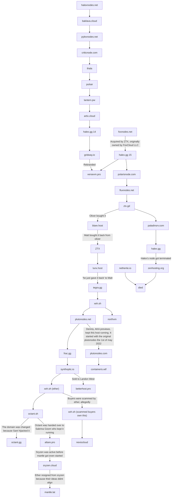
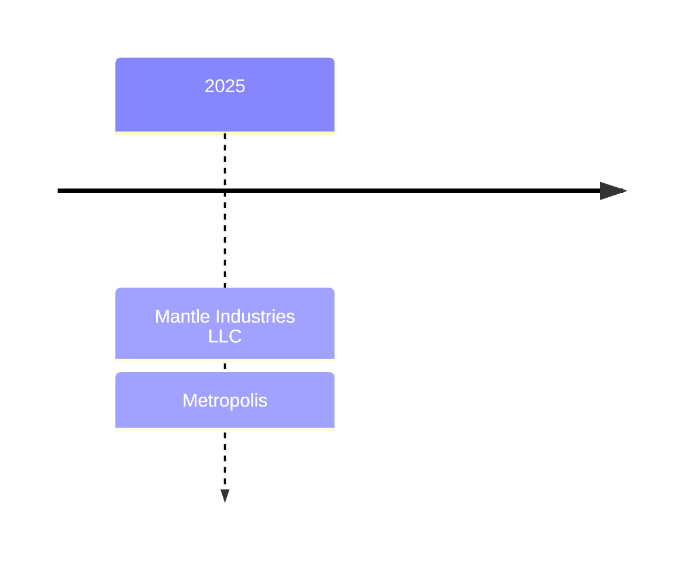
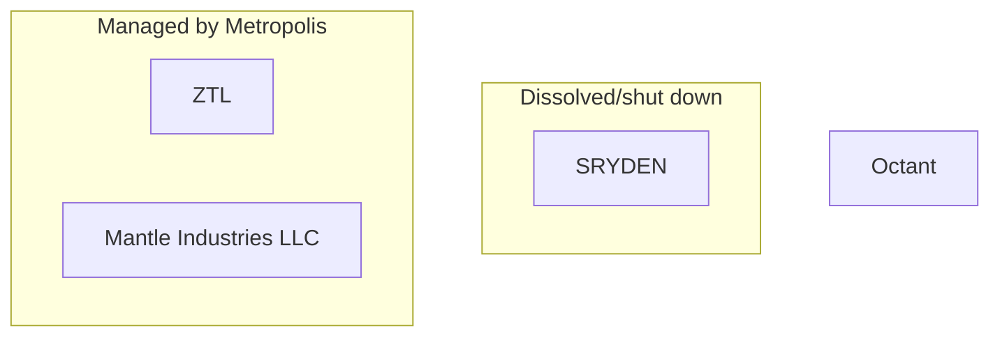

:::info

Some of the text in these graphs is a link

:::

## Hosts

```mermaid
flowchart TD;
  CRIT[criticnode.com];
  THAL[thala];
  PU[pulsar];
  HALN[halexnodes.net];
  LA[lantern.pw];
  A[artix.cloud];
  ZTX[ztx.gd];
  ZEN[zenhosting.org];
  BE[betterhost.pro];
  FR[frac.gg];
  SY[synthoptic.io];
  PL[plutonodes.net];
  PLC[plutonodes.com];
  CO[containeris.wtf];
  NE[netherite.io];
  Z2[ZTX];

  D(died);

  PY[pylexnodes.net];
  click PY href "/Hosts/pylexnodes.net";

  BAK[baklava.cloud];
  click BAK href "/Hosts/baklava.cloud";

  HAL[halex.gg]
  click HAL href "/Hosts/halex.gg";

  H14[halex.gg 14];
  click H14 href "/Hosts/halex.gg#halex-14";

  H15[halex.gg 15]
  click H15 href "/Hosts/halex.gg#halex-15";

  PO[polarisnode.com]
  click PO href "/Hosts/polarisnode.com";

  XEE["xeh.sh (ether)"];
  click XEE href "/Hosts/xeh.sh";

  XEB["xeh.sh (scammed buyers own this)"];
  click XEB href "/Hosts/nexiocloud.sh";

  GR[gridway.io]
  click GR href "/Hosts/gridway.io";

  VE[versevm.pro];
  click VE href "/Hosts/gridway.io";

  TE[tegra.gg];
  click TE href "/Hosts/tegra.gg";

  OSH["octant.sh"];
  click OSH href "/Hosts/octant.gg";

  OGG["octant.gg"];
  click OGG href "/Hosts/octant.gg";

  N["nexiocloud"];
  click N href "/Hosts/nexiocloud";
  
  NO[northvm];
  click NO href "/Hosts/northvm.net";

  AL["altare.pro"]
  click AL href "/Hosts/altare.pro";

  MA["mantle.lat"];
  click MA href "/Hosts/mantle.lat";

  SRZ["sryzen.cloud"];
  click SRZTX href "/Hosts/sryzen.cloud";

  HALN --> BAK;
  BAK --> PY;
  PY --> CRIT;
  CRIT --> THAL;
  THAL --> PU;
  PU --> LA;
  LA --> A;
  A --> H14;

  H14 --> GR;

  FO[foxnodes.net] -->|Acquired by ZTX, originally owned by FoxCloud LLC| H15;
  H15 --> PO;

  GR --> |Rebranded| VE;
  H15 --> VE;

  PO --> FLUX[fluxnodes.net]
  FLUX--> ZTX;

  ZTX --> PA[paladinsrv.com];

  PA --> HAL;
  HAL -->|Halex's node got terminated| ZEN;

  ZTX -->|Oliver bought it| BL[blare.host];
  BL -->|Matt bought it back from oliver| Z2;
  Z2 --> LU;
  LU[lunx.host] -->|'he just gave it back' to Matt| TE;
  TE --> X1[xeh.sh];
  X1 --> NO;
  X1 --> PL;
  PL -->|Dennis, AKA previews, kept this host running. It started with the original plutonodes the 1st of may 2022| PLC;
  PLC --> CO;
  PL --> FR;
  FR --> SY;
  SY -->|Sold to Landon West| BE;
  SY --> XEE;
  XEE -->|Buyers were scammed by ether, allegedly| XEB;

  XEB --> N;
  XEE --> OSH;
  OSH -->|Octant was handed over to Sabrina Goom who kept it running| AL;
  OSH -->|The domain was changed because Sam hijacked it| OGG;
  AL -->|Sryzen was active before mantle got even started| SRZ;
  SRZ -->|Ether resigned from sryzen because their ideas didnt align| MA;

  NE --> D;
  ZEN --> D;
```

## Legal entities
### History

```mermaid
timeline
  2025 : Mantle Industries LLC : Metropolis  
```

### Structure

```mermaid
graph TD;
  SRYD["SRYDEN"];
  OCT["Octant"];
  ZTL["ZTL"];
  MANT["Mantle Industries LLC"];

  subgraph Dissolved/shut down
    SRYD
  end

  subgraph Managed by Metropolis
    MANT;
    ZTL;
  end

  click SRYD href "/companies/SRYDEN";
  click ZTL href "/companies/ztl";
  click OCT href "/companies/Octant";
  click MANT href "/companies/Mantle";
  click METR href "/companies/Metropolis";
```