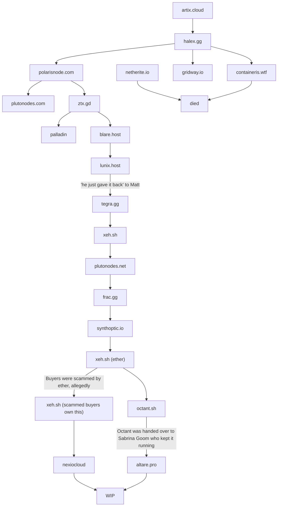

:::info

Some of the text in this graph is a link

:::

### Hosts that we know existed, thats it
*if you have any info regarding these please DM beveledcube on discord*
- Criticnode
- Pulsar
- Verse
- Lunx
- Xerylin
- Lantern
- Foxnodes
- Zen