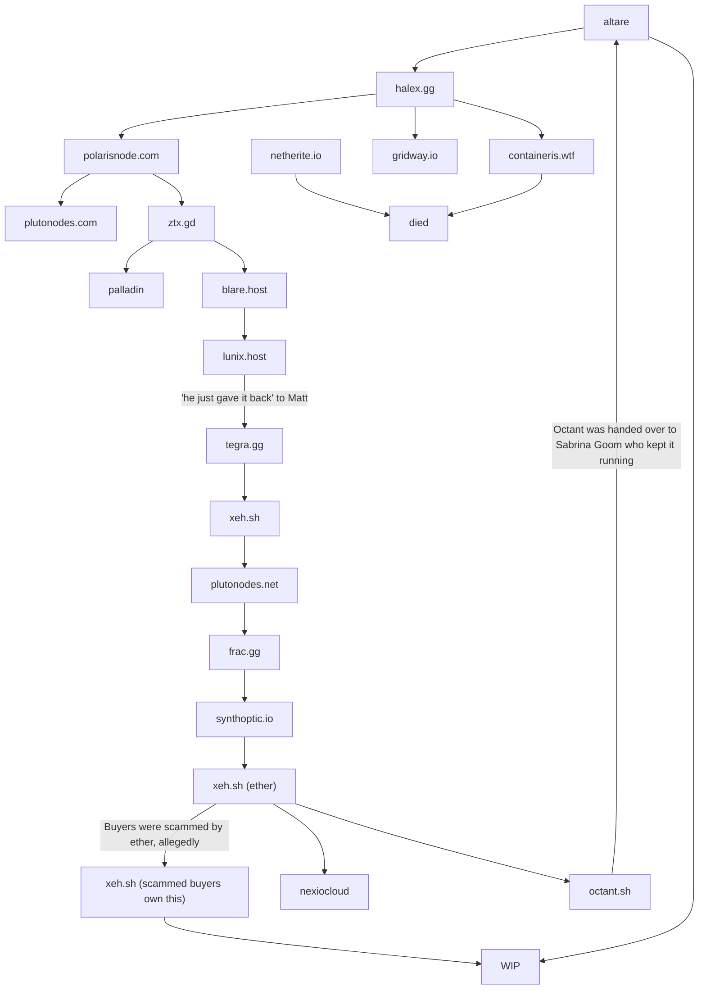

```mermaid
graph TD;
  A[artix.cloud] --> H[halex.gg];

  H --> PO[polarisnode.com];
  H --> CO[containeris.wtf];
  H --> GR[gridway.io];

  PO --> PLC[plutonodes.com];
  PO --> Z;

  Z[ztx.gd] --> PA[palladin];
  Z --> B[blare.host];
  B --> LU[lunix.host];
  LU -->|'he just gave it back' to Matt| TE[tegra.gg];
  TE --> X1[xeh.sh];
  X1 --> PL[plutonodes.net];
  PL --> FR[frac.gg];
  FR --> SY[synthoptic.io]
  SY --> XEE["xeh.sh (ether)"];
  XEE -->|Buyers were scammed by ether, allegedly| XEB["xeh.sh (scammed buyers own this)"];

  XEE --> N["nexiocloud"];
  XEE --> O["octant.sh"];
  O -->|Octant was handed over to Sabrina Goom who kept it running| A["altare"]

  XEB --> WIP[WIP];
  A --> WIP;

  NE[netherite.io] --> D[died];
  CO --> D;


  click PO href "/Hosts/polarisnode.com";
  click XE href "/Hosts/xeh.sh";
  click H href "/Hosts/halex.gg";
  click GR href "/Hosts/gridway.io";
  click TE href "/Hosts/tegra.gg";
  click O href "/Hosts/octant.sh";
  click N href "/Hosts/nexiocloud";
  click A href "/Hosts/altare";
```