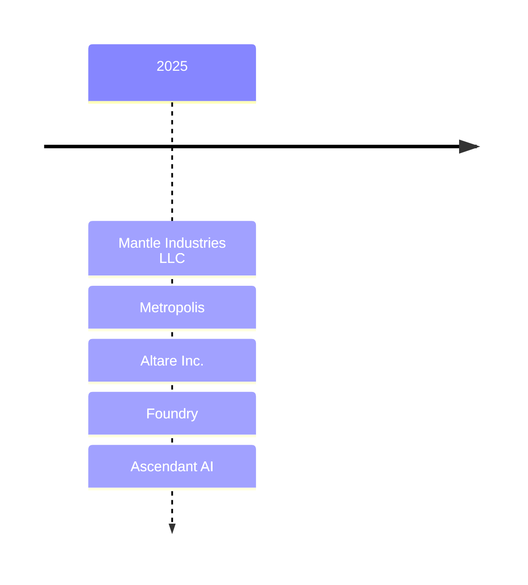

:::info

Some of the text in these graphs is a link

:::

## Hosts

```mermaid
flowchart TD;
  CRIT[criticnode.com];
  THAL[thala];
  PU[pulsar];
  HALN[halexnodes.net];
  LA[lantern.pw];
  A[artix.cloud];
  ZTX[ztx.gd];
  ZEN[zenhosting.org];
  BE[betterhost.pro];
  FR[frac.gg];
  SY[synthoptic.io];
  PL[plutonodes.net];
  PLC[plutonodes.com];
  CO[containeris.wtf];
  NE[netherite.io];
  Z2[ZTX];

  D(died);

  PY[pylexnodes.net];
  click PY href "/hosts/pylexnodesnet";

  BAK[baklava.cloud];
  click BAK href "/hosts/baklavacloud";

  HAL[halex.gg]
  click HAL href "/hosts/halexgg";

  H14[halex.gg 14];
  click H14 href "/hosts/halexgg#halex-14";

  H15[halex.gg 15]
  click H15 href "/hosts/halexgg#halex-15";

  PO[polarisnode.com]
  click PO href "/hosts/polarisnodecom";

  XEE["xeh.sh (ether)"];
  click XEE href "/hosts/xeh.sh";

  XEB["xeh.sh (scammed buyers own this)"];
  click XEB href "/hosts/nexiocloudsh";

  GR[gridway.io]
  click GR href "/hosts/gridwayio";

  VE[versevm.pro];
  click VE href "/hosts/gridwayio";

  TE[tegra.gg];
  click TE href "/hosts/tegragg";

  OSH["octant.sh"];
  click OSH href "/hosts/octantgg";

  OGG["octant.gg"];
  click OGG href "/hosts/octantgg";

  N["nexiocloud"];
  click N href "/hosts/nexiocloud";
  
  NO[northvm];
  click NO href "/hosts/northvmnet";

  MA["mantle.lat"];
  click MA href "/hosts/mantlelat";

  SRZ["sryzen.cloud"];
  click SRZTX href "/hosts/sryzencloud";

  ALT["altare.pro"];
  click ALT href "/hosts/altare/1";

  ALT3["Altare 3 (altare.cv)"];
  click ALT3 href "/hosts/altare/3";

  ALT6["Altare 6 (altr.cc)"];
  click ALT6 href "/hosts/altare/6";

  ALT7["Altare 7 (altr.cc)"];
  click ALT7 href "/hosts/altare/7";
  
  ALT8["Altare 8 (altr.cc)"];
  click ALT8 href "/hosts/altare/8";

  ASC["Ascendant"];
  click ALT8 href "/hosts/Ascendant";

  ALT10["Altare 10 (altr.cc)"];
  click ALT10 href "/hosts/altare/10";

  NA1["NA1 (na1.host)"];
  click ALT10 href "/hosts/na1";

  HALN --> BAK;
  BAK --> PY;
  PY --> CRIT;
  CRIT --> THAL;
  THAL --> PU;
  PU --> LA;
  LA --> A;
  A --> H14;

  H14 --> GR;

  FO[foxnodes.net] -->|Acquired by ZTX, originally owned by FoxCloud LLC| H15;
  H15 --> PO;

  GR --> |Rebranded| VE;
  H15 --> VE;

  PO --> FLUX[fluxnodes.net]
  FLUX--> ZTX;

  ZTX --> PA[paladinsrv.com];

  PA --> HAL;
  HAL -->|Halex's node got terminated| ZEN;

  ZTX -->|Oliver bought it| BL[blare.host];
  BL -->|Matt bought it back from oliver| Z2;
  Z2 --> LU;
  LU[lunx.host] -->|'he just gave it back' to Matt| TE;
  TE --> X1[xeh.sh];
  X1 --> NO;
  X1 --> PL;
  PL -->|Dennis, AKA previews, kept this host running. It started with the original plutonodes the 1st of may 2022| PLC;
  PLC --> CO;
  PL --> FR;
  FR --> SY;
  SY -->|Sold to Landon West| BE;
  SY --> XEE;
  XEE -->|Buyers were scammed by ether, allegedly| XEB;

  XEB --> N;
  XEE --> OSH;
  OSH -->|Octant was handed over to Sabrina Goom who kept it running| ALT;
  OSH -->|The domain was changed because Sam hijacked it| OGG;
  ALT -->|Sryzen was active before mantle got even started| SRZ;
  SRZ -->|Ether resigned from sryzen because their ideas didnt align| MA;
  MA -->|Mantle never launched| ALT3;
  ALT3 -->|They decided to change the domain for Altare v6| ALT6;
  ALT6 --> ALT7;
  ALT7 --> ALT8;
  ALT8 --> ASC;
  ASC --> ALT10;
  ALT8 --> NA1;
  NA1 --> ALT10;

  NE --> D;
  ZEN --> D;
```

## Legal entities
### History
This is based on what Ether says but the only actual legal entity is probably [ZTL](https://www.ztl.sh/)
